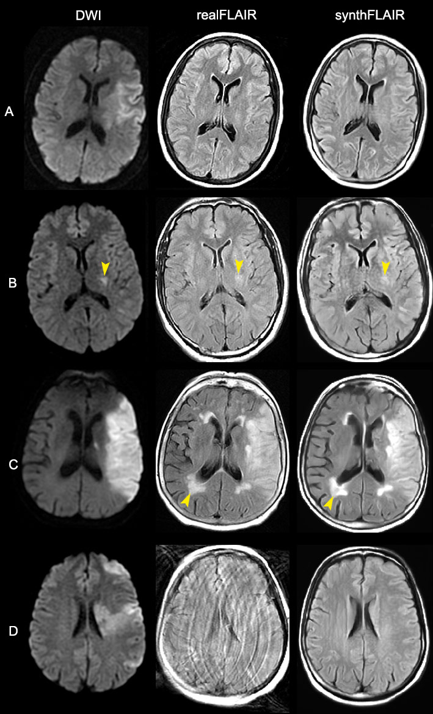

# synthFLAIR
Software designed to convert MRI diffusion-weighted sequences into FLAIR sequences

### Sample



### Prerequisites
Python 3.8

### Usage
First, clone the git directory :

```
git clone https://github.com/NeuroSainteAnne/synthFLAIR.git
cd synthFLAIR/
```

Then install required modules:

```
pip install -r requirements.txt
pip install jupyterlab
```

Open the jupyter notebook

```
jupyter notebook
```

### Data preparation

Open the [synthFLAIR-Dataprep](synthFLAIR-Dataprep.ipynb) in order to convert you NIFTI files in a Memmap format for model training

### Model training

Open the [synthFLAIR](synthFLAIR.ipynb) notebook and follow instructions to train and save your model.

### Inference

Once the model is trained and saved, you can convert 4D NIFTI DWI volumes into synthFLAIR volumes with the [synthFLAIR-Convert](synthFLAIR-Convert.ipynb) tool.

### Orthanc module

Once the model is trained and saved, you can use the Orthanc module to automatically convert DWI volumes into FLAIR using a lightweight DICOM server.
Follow the intructions at [Orthanc Module Readme](orthanc_module/README.md)
